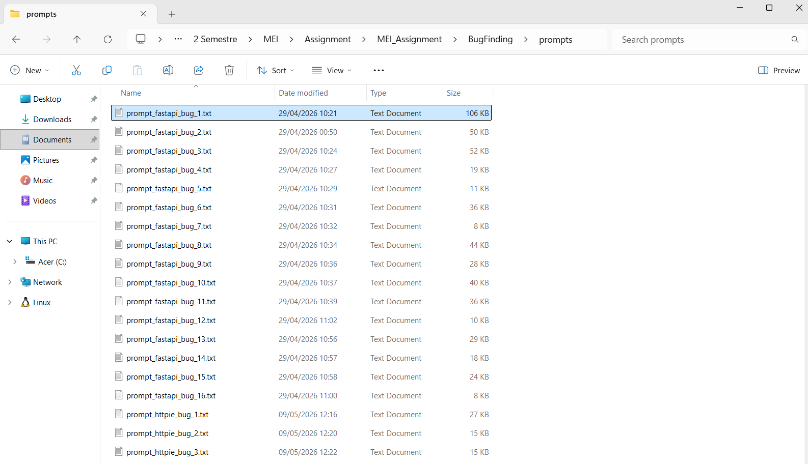
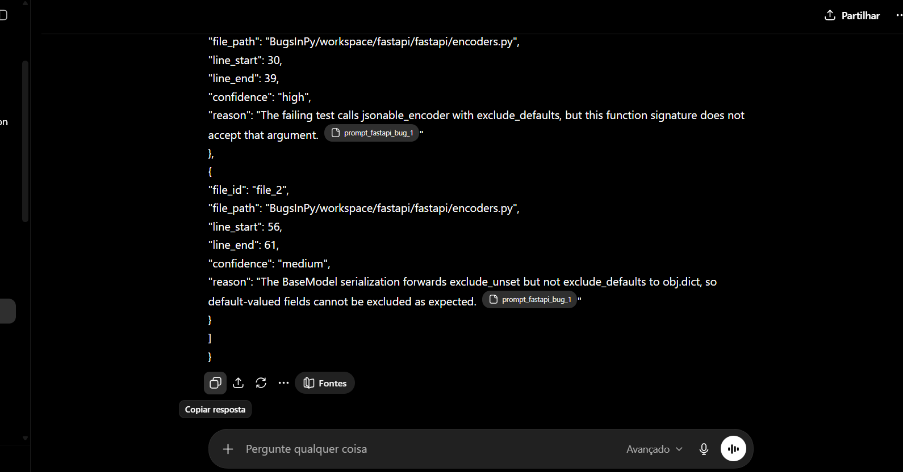
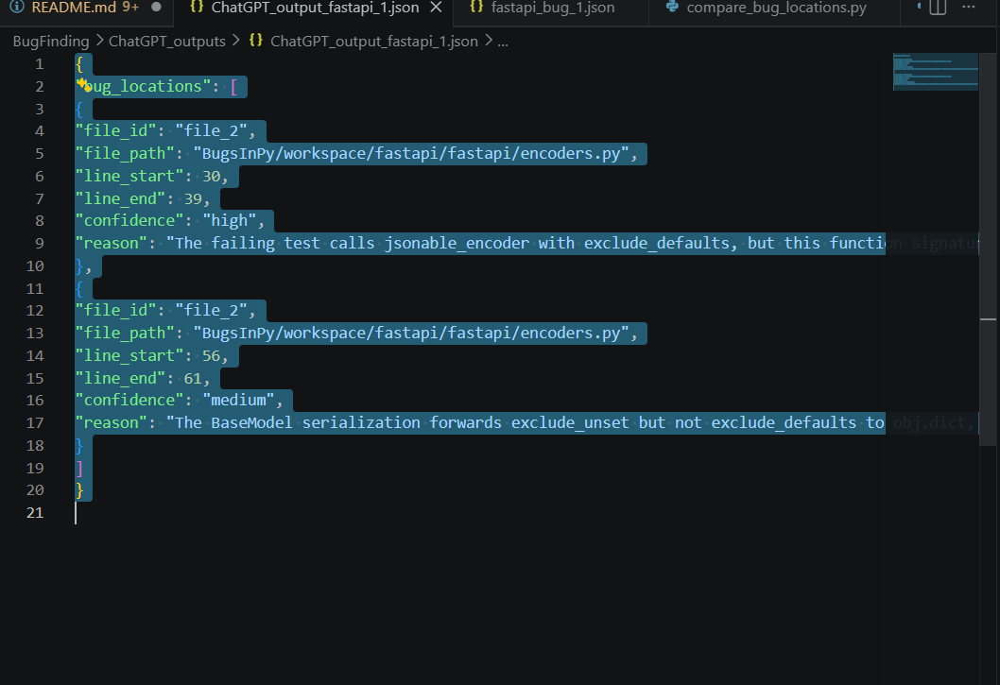
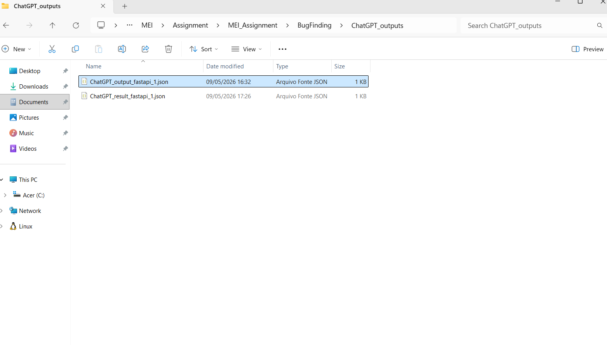

## BugFinding
For BugFinding, we are using BugsInPy. It is a "A Database of Existing Bugs in Python Programs to Enable Controlled Testing and Debugging Studies. The objective of this work is to support reproducible research on real-world Python projects."

50 bugs were selected from the projects in BugsInPy. These were selected due to their webapp python nature, which is related with our first CodeGeneration scenario.

Below are the 50 selected bugs and theirs respective projects:
| Project | Description | Number of Bugs selected |
|---|---|---:|
| fastapi | FastAPI is a modern, fast (high-performance), web framework for building APIs with Python based on standard Python type hints. | 16 |
| httpie | HTTPie (pronounced aitch-tee-tee-pie) is a command-line HTTP client. Its goal is to make CLI interaction with web services as human-friendly as possible. HTTPie is designed for testing, debugging, and generally interacting with APIs & HTTP servers. The http & https commands allow for creating and sending arbitrary HTTP requests. They use simple and natural syntax and provide formatted and colorized output. | 5 |
| sanic | Sanic is a Python 3.10+ web server and web framework that's written to go fast. It allows the usage of the async/await syntax added in Python 3.5, which makes your code non-blocking and speedy. | 5 |
| tornado | Tornado is a Python web framework and asynchronous networking library, originally developed at FriendFeed. By using non-blocking network I/O, Tornado can scale to tens of thousands of open connections, making it ideal for long polling, WebSockets, and other applications that require a long-lived connection to each user. | 16 |
| scrapy | Scrapy is a web scraping framework to extract structured data from websites. It is cross-platform, and requires Python 3.10+. It is maintained by Zyte (formerly Scrapinghub) and many other contributors. | 8 |

After selecting these bugs, the generate_llm_prompt.py was used to generate a prompt file for each bug scenario, based on the LLM_prompt.txt file example. These prompts contain the buggy files and the respective failing test files.

Thes prompts can be found in the /prompts folder, sorted by project.

# How to use the prompts
1. Open the llm and attach the prompt file in /prompts
2. Download the output as .JSON and store it in its respective folder

Example:
1. Select the prompt_fastapi_1.txt prompt in the /prompts folder and attach it to the llm prompt 
2. Copy the output and paste it to a .JSON file 

3. Store the file in /ChatGPT_outputs as ChatGPT_output_fastapi_1.json 